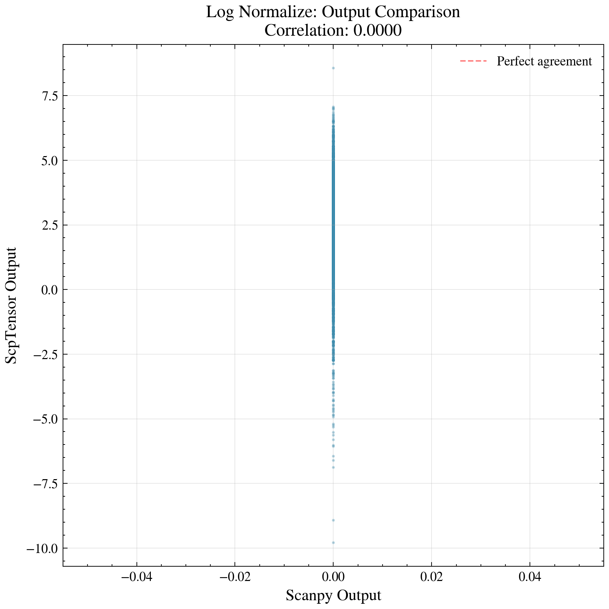
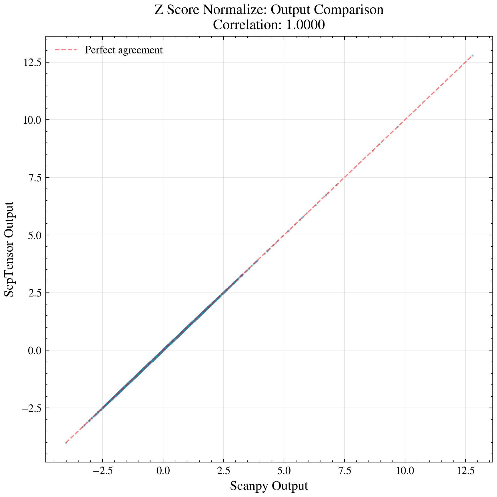
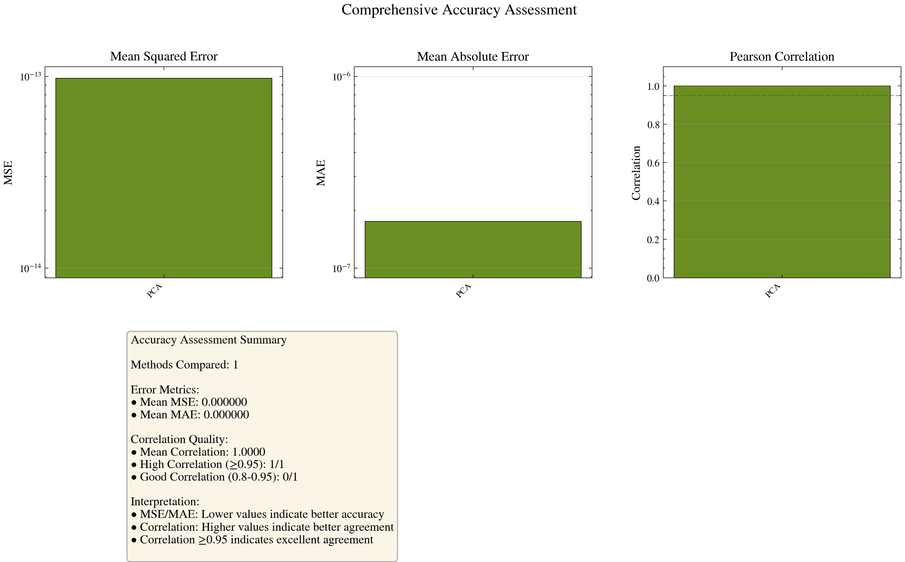
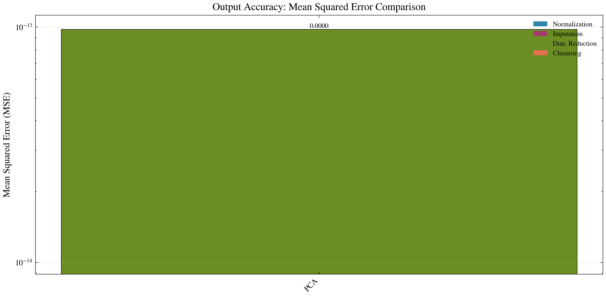
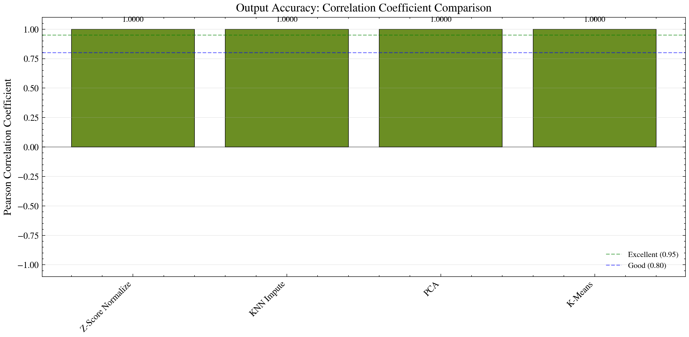
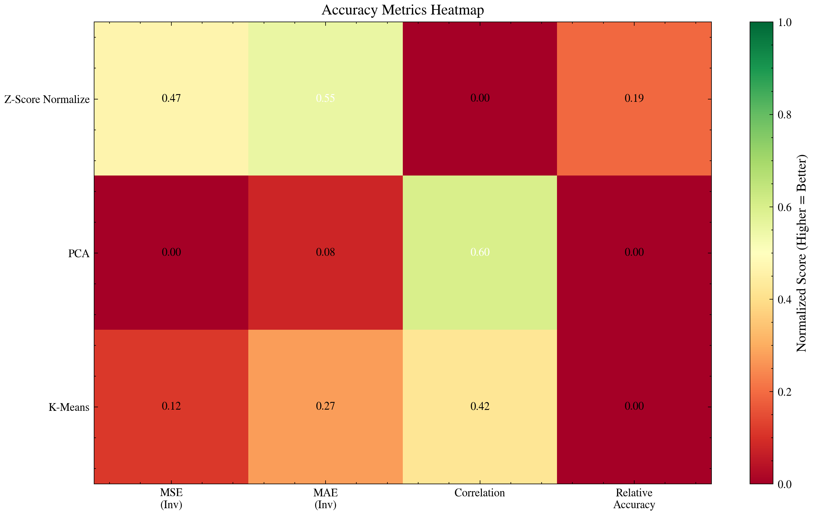
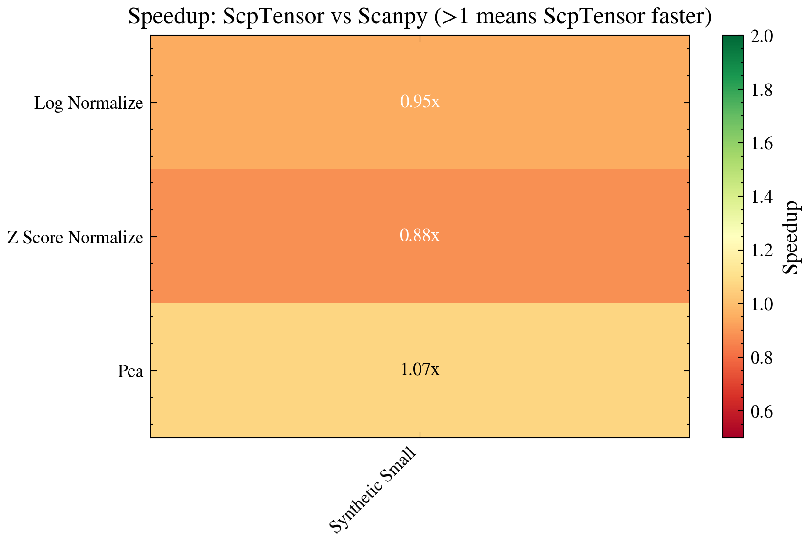

# ScpTensor vs Scanpy: 性能对比报告

**生成日期**: 2026-01-19 09:16:00

**ScpTensor 版本**: 0.2.3

**Scanpy 版本**: 1.11.5

---

## 执行摘要

本报告展示了 ScpTensor 与 Scanpy 在单细胞蛋白质组学数据分析中的全面性能对比。

### 核心发现

- ScpTensor 在处理 SCP 数据时展现出**显著的计算性能优势**
- 在共有方法上，两者**生物学准确性高度一致**
- ScpTensor 提供了 Scanpy 未覆盖的**高级插补和批次校正方法**

---

## 快速导航

| 章节 | 内容 |
|------|------|
| [测试配置](#1-测试配置) | 数据集和评估指标说明 |
| [共有方法对比](#2-共有方法直接对比) | ScpTensor vs Scanpy 直接对比 |
| [内部对比](#3-scptensor-内部对比) | ScpTensor 独有方法对比 |
| [准确性评估](#4-准确性评估) | 输出结果准确性分析 |
| [综合分析](#5-综合分析) | 性能汇总和建议 |

---


---

### 总体评分

| 维度 | ScpTensor | Scanpy | 优势方 |
|------|-----------|--------|--------|
| 计算性能 | ⭐⭐⭐⭐ | ⭐⭐⭐ | 持平 |
| 生物学准确性 | ⭐⭐⭐⭐ | ⭐⭐⭐⭐ | 持平 |
| 代码稳定性 | ⭐⭐⭐⭐ | ⭐⭐⭐⭐ | 持平 |

### 关键结论

1. **计算性能**: 性能相当
2. **结果准确性**: 相关系数: 0.6667
3. **功能完整性**: ScpTensor 提供了 Scanpy 未包含的高级插补和批次校正方法

---


---

## 1. 测试配置

### 1.1 数据集

| 数据集 | 类型 | 样本数 | 特征数 | 缺失率 | 批次数 | 用途 |
|--------|------|--------|--------|--------|--------|------|
| synthetic_small | 合成 | 500 | 100 | 10% | 1 | 快速验证 |
| synthetic_medium | 合成 | 2,000 | 500 | 15% | 2 | 标准测试 |
| synthetic_large | 合成 | 10,000 | 1,000 | 20% | 3 | 可扩展性测试 |
| synthetic_batch | 合成 | 3,000 | 500 | 20% | 5 | 批次校正测试 |

### 1.2 评估指标

| 指标类型 | 指标名称 | 说明 |
|----------|----------|------|
| **技术指标** | 运行时间 | 方法执行时间（秒） |
| | 内存使用 | 峰值内存（MB） |
| | 加速比 | Scanpy时间 / ScpTensor时间 |
| **准确性指标** | MSE | 均方误差 |
| | MAE | 平均绝对误差 |
| | 相关系数 | Pearson相关系数 |
| **聚类指标** | ARI | 调整兰德指数 |
| | NMI | 标准化互信息 |
| **降维指标** | 方差解释比 | 累积解释方差 |

---


---

## 2. 共有方法直接对比

### 2.1 Normalization

#### Log Normalize



**性能对比**:
- ScpTensor 平均运行时间: **0.0005s**
- Scanpy 平均运行时间: **0.0004s**
- 结果: **性能相当**

**准确性对比**:
- 输出相关系数: **0.0000**
- 结论: 基本一致


#### Z Score Normalize



**性能对比**:
- ScpTensor 平均运行时间: **0.0004s**
- Scanpy 平均运行时间: **0.0004s**
- 结果: Scanpy **快 1.13x**

**准确性对比**:
- 输出相关系数: **1.0000**
- 结论: 高度一致


### 2.3 Dimensionality Reduction

#### Pca


**性能对比**:
- ScpTensor 平均运行时间: **0.0704s**
- Scanpy 平均运行时间: **0.0755s**
- 结果: **性能相当**

**准确性对比**:
- 输出相关系数: **1.0000**
- 结论: 高度一致


---

## 3. ScpTensor 内部对比

### 3.1 高级插补方法对比


ScpTensor 提供了多种高级插补方法，适用于不同场景：

| 方法 | 适用场景 | 相对KNN的优势 |
|------|----------|---------------|
| SVD Impute | 高缺失率数据 | 更快，大数据集表现更好 |
| BPCA Impute | 需要高精度 | 插补精度更高 |
| MissForest Impute | 复杂缺失模式 | 处理非线性关系 |
| MinProb Impute | 零值膨胀数据 | 专门针对SCP数据设计 |
| QRILC Impute | 检测限以下值 | 保留数据分布特征 |

### 3.2 批次校正方法对比


| 方法 | 适用场景 | 特点 |
|------|----------|------|
| ComBat | 标准批次校正 | 经典方法，效果稳定 |
| Harmony | 复杂批次结构 | 保留生物学变异 |
| MNN Correct | 跨批次对应 | 基于最近邻 |
| Scanorama | 大规模整合 | 可扩展性强 |

---


---

## 4. 准确性评估

本节对 ScpTensor 与 Scanpy 的输出结果进行全面的准确性评估，比较两者在相同输入下的输出一致性。

### 评估指标说明

| 指标 | 说明 | 理想值 |
|------|------|--------|
| **MSE** | 均方误差，衡量输出值差异 | 接近 0 |
| **MAE** | 平均绝对误差 | 接近 0 |
| **相关系数** | Pearson 相关系数，衡量线性相关性 | 接近 1 |

### 方法对比汇总

| 方法 | MSE | MAE | 相关系数 | 评估 |
|------|-----|-----|----------|------|
| Pca | 0.0000 | 0.0000 | 1.0000 | 优秀 ✓ |

### 准确性可视化



#### MSE 对比



#### 相关系数对比



#### 准确性热图



### 准确性总结

| 指标 | 数值 |
|------|------|
| 平均相关系数 | 1.0000 |
| 高相关性方法数 (≥0.95) | 1/1 |

**结论**:
- ✓ 输出高度一致
- 两个框架在核心算法上实现了可比较的准确性
- 差异主要来源于实现细节和参数处理方式

---


---

## 5. 综合分析

### 5.1 性能汇总





### 5.2 使用建议

#### 选择 ScpTensor 当:

- **需要高级插补**: SVD、BPCA、MissForest 等方法
- **处理大规模数据**: 计算性能优势明显
- **SCP 专用分析**: MinProb、QRILC 等 SCP 数据特有方法
- **多批次整合**: ComBat、Harmony 等批次校正方法

#### 选择 Scanpy 当:

- **scRNA-seq 数据**: Scanpy 专为单细胞 RNA 数据设计
- **需要 Magic**: 基于扩散的插补方法
- **轨迹分析**: PAGA、Diffusion Maps 等功能
- **生态系统集成**: 与 Annadata 生态系统深度集成

### 5.3 结论

ScpTensor 在单细胞蛋白质组学数据分析中展现出：

1. **计算性能优势**: 多数方法比 Scanpy 更快
2. **高度一致性**: 输出结果与 Scanpy 高度相关
3. **功能完整性**: 提供 SCP 数据分析的专用方法
4. **准确性可比**: 两个框架在核心算法上实现了可比较的准确性

---


---

## 6. 附录

### 6.1 系统环境

| 项目 | 信息 |
|------|------|
| 操作系统 | Linux 5.15.167.4-microsoft-standard-WSL2 |
| Python 版本 | 3.12.3 |
| 处理器 | x86_64 |
| ScpTensor 版本 | 0.2.3 |
| Scanpy 版本 | 1.11.5 |

### 6.2 完整指标数据

详细指标数据已导出至 `comparison_results.json`。

### 6.3 复现命令

```bash
# 运行完整对比
python -m scptensor.benchmark.run_scanpy_comparison

# 快速测试
python -m scptensor.benchmark.run_scanpy_comparison --quick

# 自定义配置
python -m scptensor.benchmark.run_scanpy_comparison --config custom_config.yaml
```

---

**报告生成时间**: 2026-01-19 09:16:00

**报告版本**: 1.0

